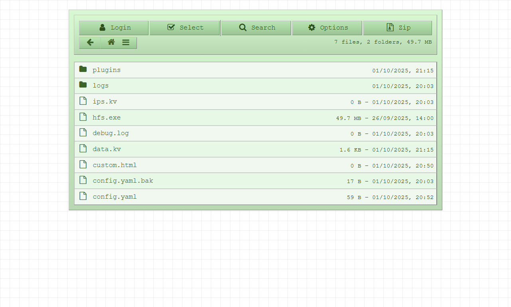

# Vintage Theme for HFS 3

## Introduction

_This is Vintage theme for HTTP File Server (HFS) version 3. This theme is inspired by old vintage/retro style design._

## Installation

_To install the Vintage theme for HFS 3, please follow these steps:_

##### Download via HFS admin panel:

1. _Open the HFS admin panel in your web browser._
2. _Go to the 'Plugins' section and click on `SEARCH ONLINE`._
3. _Click on the search icon and search for `hfs-vintage-theme`_
4. _Click on the download button and run the plugin once downloaded._

##### Download manually or using git:

1. _Download this repository by clicking [here](https://github.com/8gudbits/hfs-vintage-theme/archive/refs/heads/main.zip) or clone it using Git with the following command:_

   ```bash
   git clone --depth 1 https://github.com/8gudbits/hfs-vintage-theme.git
   ```

2. _Navigate to the downloaded or cloned repository folder._
3. _Copy the `dist` folder from the repository into the `plugins` folder of your HFS installation directory._
4. _Open the HFS admin panel in your web browser._
5. _Go to the 'Plugins' section and activate the Vintage theme._

## Screenshot



---

<p align="center">Enjoy your retro experience with the Vintage theme for HFS 3!</p>

---

